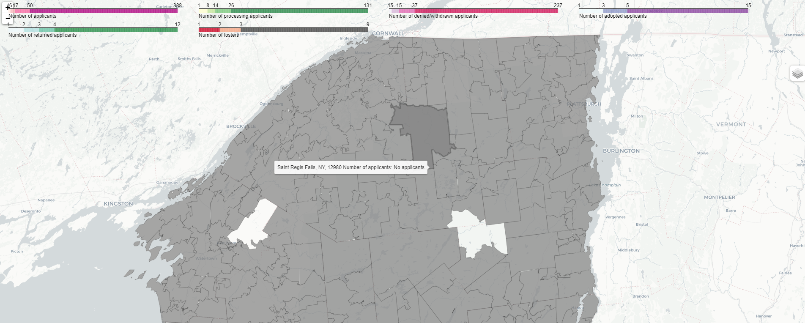
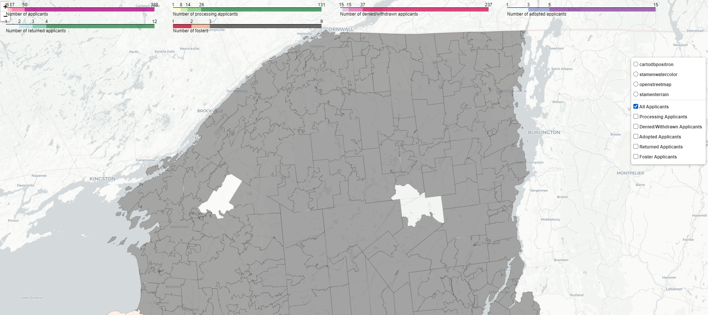

# OPH-Adoption-Map
This map was created in Python for Operation Paws for Homes, the data sources and personal information has been redacted.
Map contains an interactive zip code map showing different filters such as: All Applicants, Processing, Denied/Withdrawn, Adopted, Returned, and Fosters.

Python Packages used:
Folium- interactive map
zipcodes- used to cross reference zip codes with data and data clean
pandas- dataframes

